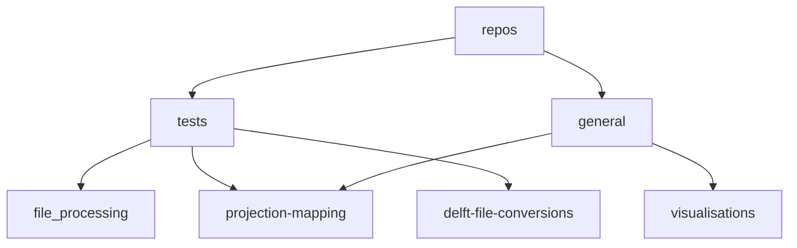

<head>
  
</head>

<body>
  

  <h1>
    <b>
    Welcome to the Anchor Environmental GitHub! ⚓
    </b>
  </h1>

 
  
---
  
> [!NOTE]
> <h6><em>This is a work in progress and stuff still needs to be added! 🚧</em></h6>
---
> [!IMPORTANT]
> <h4>TODO: </h4>

 - [ ] Description https://github.com/Anchor-Environmental/.github/issues/1
 - [ ] Directions https://github.com/Anchor-Environmental/.github/issues/2
 - [ ] Source control explanation
 - [ ] Structure of Repos
       
<h3>Description:</h3>

    This is the home for code that we write for projects. 
    The code does not have to be oraganised according to a project. 
    You can create a repo and store it for each use case. 
    We can pull all the code together based on whats required for a project and it can be updated accordigly!
  
  ---

  
  

    
  

  ---

</body>

