<head>
  <a href="https://anchorenvironmental.co.za/">
    
  </a>
</head>

<body>
  <p>
  <h1>
    <b>
    Welcome to the Anchor Environmental GitHub! ⚓
    </b>
  </h1>
</p> 
</body>

---

### Description ✍️:
    This is the home for code that we write for projects. The code does
    not have to be oraganised according to a project. You can create a
    repo and store it for each use case. We can pull all the code together
    based on whats required for a project and it can be updated accordigly!

### Usage/Guide 🦮:
    1. Follow the links to the repective repo
    2. Click on the <> Code button and copy the https url
    3. Open a terminal/shell at your local directory and paste the following command with your link:

```Shell
git clone "paste link here"
```

### Code Structure 🗺️:

```mermaid
%%{init: {'theme':'base', 'themeVariables': {
      'primaryColor': '#61778d',
      'primaryTextColor': '#fff',
      'primaryBorderColor': '#8495a6',
      'lineColor': '#2c2c2c',
      'secondaryColor': '#8495a6',
      'tertiaryColor': '#8495a6'
    }}}%%
flowchart LR
  A(repos):::layer0-->B(delft):::layer1
  B(delft)-->C(file-processing):::layer2
  B-->J(mercator-processing):::layer2
  B-->E(delft-file-conversions):::layer2
  B-->D(projection-mapping):::layer2
  A(repos)-->F(general):::layer1
  F-->G(visualisations):::layer2
  F-->D(projection-mapping):::layer2
  F-->I(GUI-Base):::layer2
  F-->K(species-database-generator):::layer2
  F-->L(CTD-processing):::layer2

 classDef layer0 fill:#2b3846
 classDef layer1 fill:#61778d
 classDef layer2 fill:#8495a6
```

  ---


