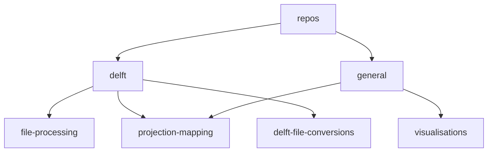

<head>
  
</head>

<body>
  

  <h1>
    <b>
    Welcome to the Anchor Environmental GitHub! ⚓
    </b>
  </h1>

 
</body>

---
  
> [!NOTE]
> <h6><em>This is a work in progress and stuff still needs to be added! 🚧</em></h6>
---
### Description ✍️:
    This is the home for code that we write for projects. 
    The code does not have to be oraganised according to a project. 
    You can create a repo and store it for each use case. 
    We can pull all the code together based on whats required for a project and it can be updated accordigly!

### Usage/Guide 🦮:
    Follow the links to the repective repo
    Find the copy https link to the repo
    Open a terminal/shell at a local directory and paste the following command
    git clone
---

  
  

    
  

  ---

